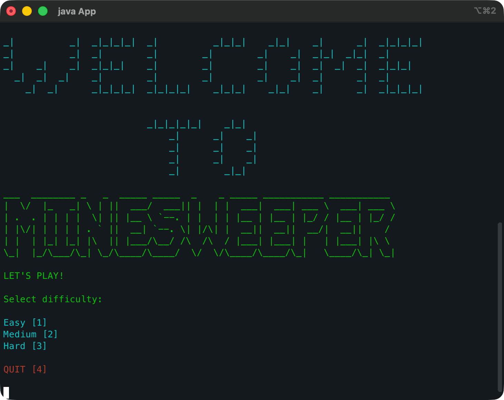
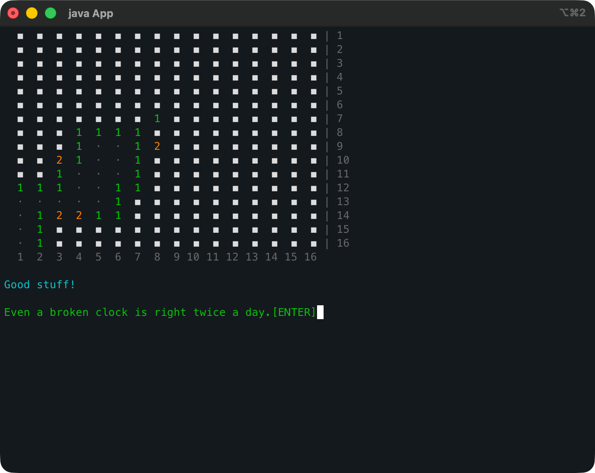
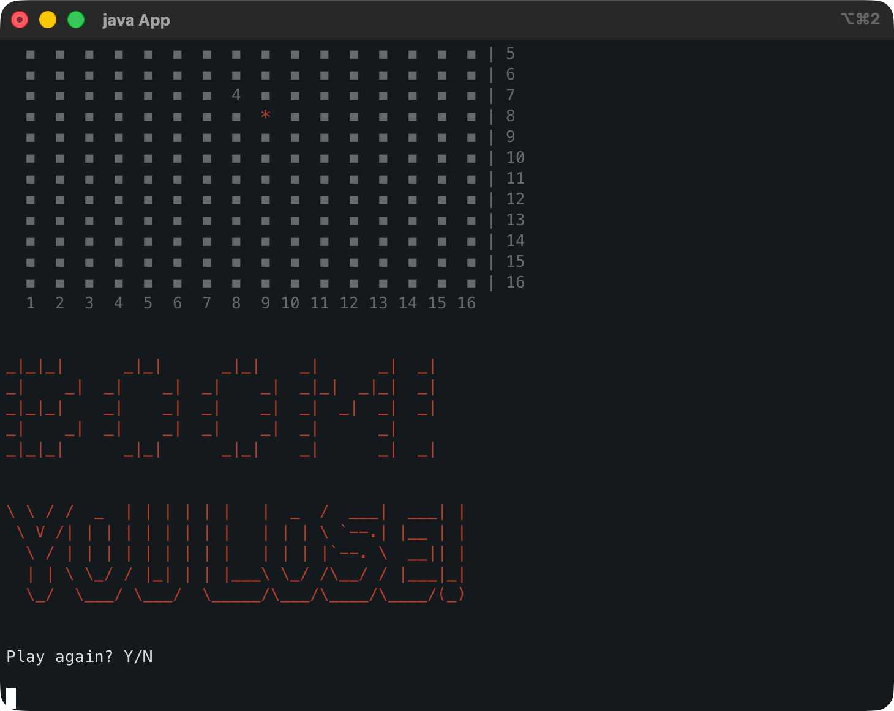

# Minesweeper

A terminal-based Minesweeper game built in Java. Coloured ANSI output, Unicode rendering, cascading reveal, flagging, difficulty selection, and a sassy personality.

## Features

- **Three difficulty levels** — Easy (10×10, 10 mines), Medium (16×16, 40 mines), Expert (24×24, 99 mines)
- **Coloured ANSI rendering** — numbers gradient green→orange→red by danger level, grey labels, full-colour ASCII art welcome/loss/win screens
- **Unicode board** — `■` hidden cells, `·` for revealed empty, `*` for mines, `!` for flags
- **Cell selection highlight** — selected cell glows purple before reveal/flag confirmation
- **Flagging** — toggle flags on unrevealed cells (orange `!`), cyan highlight distinguishes flagged cells from unmarked
- **Cascading reveal** — empty cells recursively flood-fill neighbours
- **Contextual messages** — safe reveals get cheeky encouragement, close calls get tension, deadly cells get warnings
- **Randomised continue prompts** — 10 sassy messages (Thor, Michael Scott, Han Solo, Kris Jenner)
- **Full input validation** — non-numeric and out-of-bounds input caught cleanly
- **Replay loop + quit** — play again at any game end, or quit from the difficulty menu
- **ANSI screen clearing** — `\033[2J\033[H` escape codes instead of println spam
- **Board greys out on death** — all colours muted on game over, only the mine stays red

## Screenshots







## How to run

```bash
# Compile
javac -d bin src/**/*.java src/*.java

# Run
java -cp bin App
```

## Project structure

```
src/
├── App.java                    # Entry point
├── board/
│   ├── Board.java              # Grid logic, mine placement, adjacent counts, flood-fill, flagging
│   └── Cell.java               # Cell state (mine, revealed, adjacent count, flagged)
├── minesweeper/
│   └── Minesweeper.java        # Game loop, rendering, input handling, win/loss, replay
└── ui/
    ├── Welcome.java            # Mono12 block-art welcome banner
    ├── WinScreen.java          # Block-art win screen
    ├── LoseScreen.java         # Block-art + doom-font loss screen
    ├── messages.java           # Random contextual feedback after each reveal
    └── continueMessages.java   # Random sassy continue prompts
    └── util/
        └── Color.java          # ANSI escape code enum (8 colours including 256-colour orange)
```
